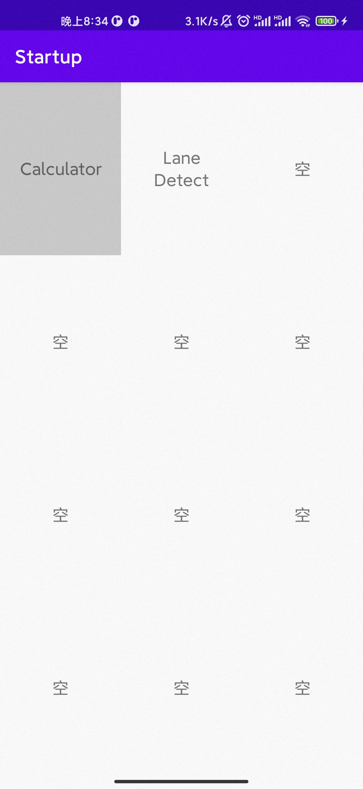
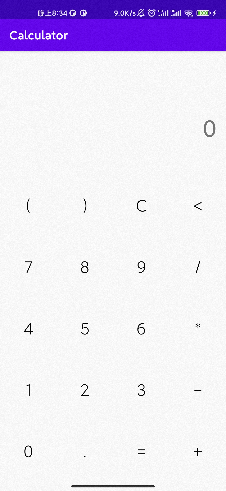
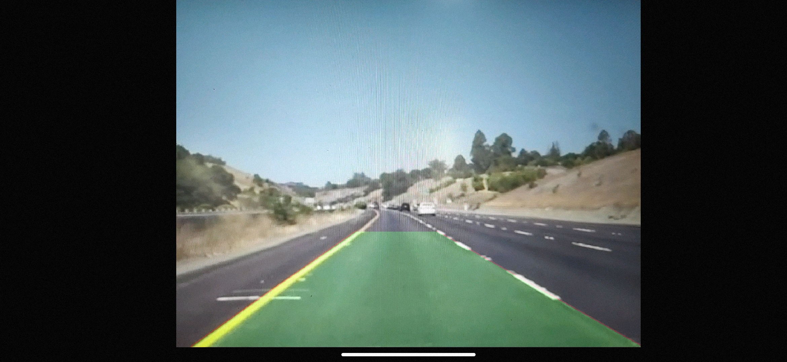

# Android Starup & Calculator & OpenCV Demo

Homework for Android

## Requirements

[OpenCV](https://opencv.org/releases/): 4.5.2

## Usage

Modify the `openCVSdk` in the `settings.gradle` file to your own path.

```groovy
def openCVSdk = '../OpenCV-android-sdk'
```

Or set environment variables:

```bash
opencv_java='../OpenCV-android-sdk'
```

Run!

## Interface

Statup:



Calculator:



Lane detection:

